# CompleteWGS
This is a pipline the enables the mapping, variant calling, and phasing of input fastq files from a PCR free (PF) and a Complete Genomics' stLFR (Single-Tube Long Fragment Read, a DNA cobarcoding technology) library of the same sample. Running this pipeline results in a highly accurate and complete phased vcf. We recommend at least 40X depth for the PCR free library and 30X depth for the stLFR library. Below is a flow chart which summarizes the pipeline processes. *Note, SV detection has not yet been enabled on the current version of the pipeline.


# Requirements  
**Hardware requirements**  
Multiple core computer  
Minium 72GB RAM  
Exact storage may vary depending on sample count and coverage, expect 1TB per sample.  
**Software requirements**  
Linux CentOS >=7  
You may need root access to install Singularity  

# Installation   
1. On a Linux server, install singularity >= 3.8.1 with root on every nodes.
   
2. Download the singularity images (internet connection required) by the following commands:
```
cat <<EOF > CWGS.def
Bootstrap: docker
From: stlfr/cwgs:1.0.6
%post
    cp /90-environment.sh /.singularity.d/env/
EOF

singularity build --fakeroot CWGS.sif CWGS.def
```
The users have no root permission may build the .sif file locally then upload to server.  
If the singularity doesn't support --fakeroot, you need sudo permission to run this command:
sudo singularity build CWGS.sif CWGS.def
```
singularity exec -B`pwd -P` --pwd `pwd -P` CWGS.sif cp -rL /usr/local/bin/CWGS /usr/local/bin/runit /usr/local/app/CWGS/PARAMS.txt /usr/local/app/CWGS/demo .
```
3. Download the database (internet connection required) by this command:
```
./CWGS -createdb
```
Or for MegaBolt or ZBolt nodes
```
./CWGS -createdb --megabolt
```
This command will download around 32G data from internet and build index locally, which will occupy another 30G storage.
 
4. Test demo data:

```
cat << EOF > samplelist.txt
sample  stlfr1                      stlfr2                      pcrfree1                 pcrfree2
demo    demo/stLFR_demo_1M_1.fq.gz  demo/stLFR_demo_1M_2.fq.gz  demo/PF_demo_1M_1.fq.gz demo/PF_demo_1M_2.fq.gz
EOF
 
./CWGS samplelist.txt -local
```
Test demo data on clusters by SGE (Sun Grid Engine):
```
./CWGS samplelist.txt --queue mgi.q --project none
```
Test demo data on clusters by SGE (Sun Grid Engine) with MegaBolt/ZBolt nodes:
```
./CWGS samplelist.txt -bolt --queue mgi.q --project none --boltq fpga.q
```

# Run the pipeline  
**Note that the order of parameters matters: single dash parameters (-opt) should be placed before all double dash parameters (--opt)**     
     
1. Generate sample.list.
   start from fastq files (default)
      E.g.
   ```
   cat << EOF > sample.list
   sample	stlfr1	stlfr2	pcrfree1	pcrfree2
   demo1	/path/to/stLFR_01_1.fq.gz	/path/to/stLFR_01_2.fq.gz	/path/to/PCRfree_01_1.fq.gz	/path/to/PCRfree_01_2.fq.gz
   demo2	/path/to/stLFR_02_1.fq.gz	/path/to/stLFR_02_2.fq.gz	/path/to/PCRfree_02_1.fq.gz	/path/to/PCRfree_02_2.fq.gz
   EOF
   ```
      *paths above can be both absolute and relative
   
    start from barcode (BC) split/deconvolution fastq files (set --skipBarcodeSplit true)
      format same as above.
   
    start from PCR-free and stLFR bam files (set --frombam true)
      E.g.
   ```
   cat << EOF > sample.list
   sample	stlfrbam	pfbam
   demo1	/path/to/stLFR_01.bam	/path/to/PCRfree_01.bam
   demo2	/path/to/stLFR_02.bam	/path/to/PCRfree_02.bam
   EOF
   ```
2. Run settings
    Set CPU
    ```
    --cpu2 INT
      Specify cpu number for QC, markdup, bam downsample, merge bam, bam stats calculation. [24]

    --cpu3 INT
      Specify cpu number for alignment and short variants calling (including BQSR and VQSR, if specified). [48]
    ```
    Sample the input fastq files
    ```
    --sampleFq BOOL
      if you want to initially sample the fastq file, set it true. [false]
    the following settings are valid only sampleFq is true
    --stLFR_fq_cov INT [only valid when '--sampleFq true']
    sample stLFR reads to this coverage [40] 
    
    --PF_fq_cov INT [only valid when '--sampleFq true']
    sample PCR-free reads to this coverage [50] 
    ```
    Alignment (BWA or Lariat) and variant calling (GATK or Deepvariant (DV)) relevant settings   
    ```
    --align_tool STRING
      Specify the alignment tool for stLFR reads. [lariat]
      Supports:
        bwa
        lariat
        bwa,lariat (this will execute both)

    --var_tool STRING
      Specify the variant calling tools for merged bam file. [dv]
      Supports:
        gatk
        dv (DeepVariant)
        gatk,dv (this will execute both)
    ```
    *If two alignment tools ("lariat,bwa") and two variant calling programs ("gatk,dv") are specified, four result sets will be generated.
    ```
    --gatk_version STRING [only valid when '--var_tool' contains "gatk"]
      Specify the GATK version. [v4]
      Supports:
        v3
        v4

    --run_bqsr BOOL [only valid when '--var_tool' contains "gatk"]
      Run Base Quality Score Recalibration (BQSR) of GATK. [true]

    --run_vqsr BOOL [only valid when '--var_tool' contains "gatk"]
      Run Variant Quality Score Recalibration (VQSR) of GATK. [true]

    --split_by_intervals BOOL [only valid when '--var_tool' contains "gatk" and '--use_megabolt' is false]
      Utilizes -L option for GATK haplotypecaller; split by chromosome. [true]

    --dv_version STRING [only valid when '--var_tool' contains "dv"]
      Specify the DeepVariant version. [v1.6]
      Supports: 
        v1.6
        v0.7
      Current MegaBOLT DeepVariant version is v0.7; therefore, if you specify this option to "v1.6", MegaBOLT will not be used even if '--use_megabolt' is true.
    ```
    Markdup
    ```
    --markdup STRING
    Specify the mark duplicates tool. [biobambam2]
    Supports: 
      biobambam2 (much faster than picard; recommended)
      picard
      gatk4 (MarkDuplicatesSpark)
      sambamba (not recommended)
    ```
    Downsample the bam file
    ```
    --sampleBam BOOL
      Whether downsample the stLFR bam and PCR-free bam. [true]

    --stLFR_sampling_cov INT [only valid when '--sampleBam true']
      Downsample stLFR bam to the specified coverage. [30]

    --PF_sampling_cov INT [only valid when '--sampleBam true']
      Downsample PCRFree bam to the specified coverage. [40]
    ```
    Merge the bam
    ```
    --PF_lt_stLFR_depth INT
      Extract the intersection regions from the sampled stLFR bam with depth greater than (>) this value and PCRFree bam with depth less equal than (<=) this value. [10]
    ```
    Enable resuming the running
    ```
    --keepFiles BOOL
      By default, useless intermediate files will be deleted during the analysis to save storage. If you want to resume the run, set it true. [false]
    ```
    Debug mode (if you plan to rerun with different parameter setting to tune the results, use **-debug**)
    ```
    -debug
    By default, each process only keeps the output files. If you want to check the intermediate files within a process, use this flag.
    ```

3. Executor and MegaBOLT setting, four combinations:
    Make sure CWGS is in your PATH.
    1. on clusters by SGE (Sun Grid Engine) and no MegaBOLT (default)
        Confirm the working queue and project number, which can be specified using --queue, and --project for regular queue, and project id, respectively. Use "--project none" if the system doesn't support a project id.
        E.g.
        ```
        CWGS sample.list --queue all.q --project none > run.log 2>&1 &
        ```
    2. on clusters by SGE with MegaBOLT nodes.
        Ensure the clusters contain at least one MegaBOLT queue and have a queue for them, e.g. bolt.q.
        Confirm the working queue and project number, which can be specified using --queue, --boltq, and --project for regular queue, MegaBOLT queue, and project id, respectively. Use "--project none" if the system doesn't support a project id.
        E.g.
        ```
        CWGS sample.list -bolt --queue all.q --boltq bolt.q --project none > run.log 2>&1 &
        ```
    3. locally run.
        Run with "-local" option. 
        E.g.
        ```
        CWGS sample.list -local > run.log 2>&1 &
        ```
    4. locally run on a MegaBOLT machine.
        Run with "-local" & "-bolt" option. 
        E.g.
        ```
        CWGS sample.list -local -bolt > run.log 2>&1 &
        ```


A more detailed flow chart.  


# Output of the demo example  
**Results**  
All output in the ./CWGS_run folder.   
1. The ./CWGS_run/out/report.csv is a summary report, with all intermediate metrics, results of mapping, variant calling, phasing etc.     
  
2. FQ, BAM, VCF output   
The FQs are in ./CWGS_run/out/<sample_name>/fq, QC by SOAPnuke.  
(demo_split_*.fq.gz are the FQ after barcode deconvolution)   
```
demo.pf.bssq
demo.pf.qc_1.fq.gz
demo.pf.qc_2.fq.gz
demo_split_1.fq.gz
demo_split_2.fq.gz
split_stat_read1.log
```
The BAMs in in ./CWGS_run/out/<sample_name>/align
```
06.lfr_highquality.txt
06.lfr_length.txt
06.lfr_per_barcode.txt
06.lfr_readpair.txt
demo.cmrg.cov
demo.lariat.cov10.intersect.bed
demo.lariat.dv.vcf.gz
demo.lariat.dv.vcf.gz.tbi
demo.lariat.merge.bam
demo.lariat.merge.bam.bai
demo.lfr.report
demo.merge.cmrg.hist.bed
demo.merge.cmrg.mean.bed
demo.pf.bwa.dv.vcf.gz
demo.pf.bwa.dv.vcf.gz.tbi
demo.pf.cmrg.hist.bed
demo.pf.cmrg.mean.bed
demo.pf.megaboltbwabqsr.bam
demo.pf.megaboltbwabqsr.bam.bai
demo.stlfr.lariat.biobambam2.bam
demo.stlfr.lariat.biobambam2.bam.bai

```
The phased VCF in in ./CWGS_run/out/<sample_name>/phase
```
demo.lariat.dv.hapblock
demo.lariat.dv.hapcut_stat.txt
demo.lariat.dv.phase.report
demo.lariat.dv.phased.vcf.gz
demo.lariat.dv.phased.vcf.gz.tbi
```

**Log file**  
1. The run.log shows excution information etc.  
For a typical run of 1 sample, with 30x StLFR and 40x PCR free library, with 60CPU:  
megabolt: ~14hr   
non-megabolt: ~42hr  
2. The ./CWGS_run/report.html is output of nextflow, with runtime, CPU usage etc.  
3. The ./CWGS_run/trace.txt shows excution of each steps, use trace.txt to find intermediate files/folders.   

# Customize 
To customize and make the pipeline adapt to your needs, you may revise the scripts in the modules folder and run with the -module tag  
```
CWGS sample.list -sing /usr/local/bin/singularity -module <your_modules_path> -local -debug  
```

# Reference   
1. [Lariat](https://github.com/10XGenomics/lariat)  
A Linked-Read Alignment Tool  
2. [Deepvariant](https://github.com/google/deepvariant)  
A deep learning-based variant caller  
3. [Hapcut2](https://github.com/vibansal/HapCUT2)  
A haplotype assembly tool
4. [SOAPnuke](https://github.com/BGI-flexlab/SOAPnuke)  
A novel quality control tool  
